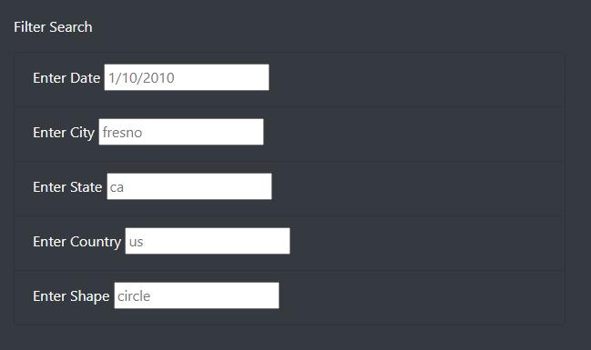
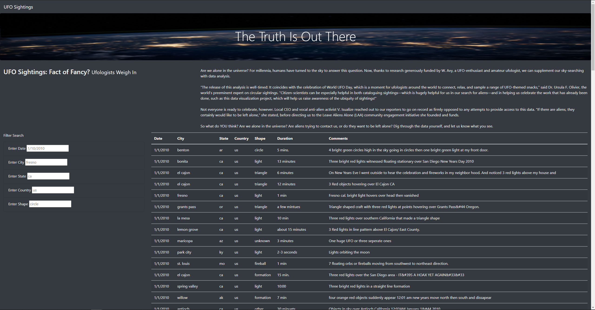
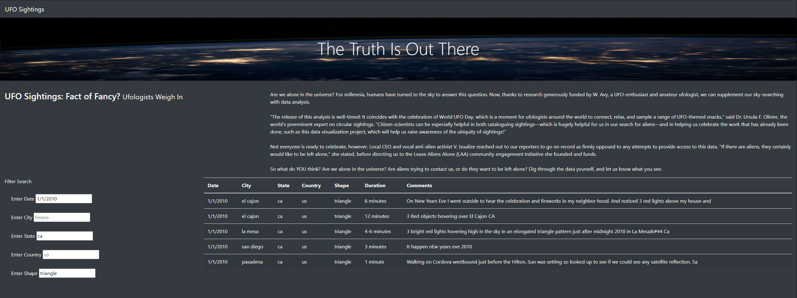

# UFO Analysis with Javascript and HTML

## Overview of Analysis

### Purpose
The purpose of this project was to create a webpage that would provide an in-depth analysis of UFO sightings by allowing users to filter for multiple criteria at the same time.

## Results: How to Perform a Search
To allow the user to search through the UFO data, I created a container in the HTML file where the user could input their search and filter the data based on five criteria: Date, City, State, Country, and Shape.

```
<div class="container-fluid">
  <div class="row">
    <div class="col-md-3">
      <form>
          <p>Filter Search</p>
      </form>
      <ul class="list-group">
          <li class="list-group-item bg-dark">
              <label for="datetime">Enter Date</label>
              <input type="text" id="datetime" placeholder="1/10/2010">
          </li>
          <li class="list-group-item bg-dark">
              <label for="city">Enter City</label>
              <input type="text" id="city" placeholder="fresno">
          </li>
          <li class="list-group-item bg-dark">
            <label for="state">Enter State</label>
            <input type="text" id="state" placeholder="ca">
          </li>
          <li class="list-group-item bg-dark">
            <label for="country">Enter Country</label>
            <input type="text" id="country" placeholder="us">
          </li>
          <li class="list-group-item bg-dark">
            <label for="shape">Enter Shape</label>
            <input type="text" id="shape" placeholder="circle">
          </li>
      </ul>
    </div>
 ```

This script creates the Filter Search area on the webpage.



In order for the user-inputted search criteria to work on the UFO data, I had to create a function that saves the element, value, and ID of the filter that was changed.

```
var filters = {};

function updateFilters() {

    let changedElement = d3.select(this);
    
    let elementValue = changedElement.property("value");
    console.log(elementValue)

    let filterId = changedElement.attr("id");
    console.log(filterId)

    if (elementValue) {
      filters[filterId] = elementValue;
    }
    else {
      delete filters[filterId];
    }
  
    filterTable();
  }
```

I then created a function that loops through the UFO data and keeps only the results that match the user-inputted search criteria.

```
  function filterTable() {
  
    let filteredData = tableData;
  
    for (fil in filters) {
      filteredData = filteredData.filter(row => row[fil] === filters[fil]);
     };

    buildTable(filteredData);
    }

  d3.selectAll("input").on("change", updateFilters);
  
  buildTable(tableData);
```

This script now allows for the user to search through the UFO data by using the filter options. Here is the webpage as it exists without any filters:



If the user were to input search criteria into the filters such as '1/1/2010' into Date, 'ca' into State, and 'triangle' into Shape, the webpage would filter the UFO data and produce only data that matches the criteria:



## Summary
Overall, this webpage provides a useful and practical way for people to get an in-depth analysis of UFO sightings, allowing users to filter for multiple criteria at the same time. As with most projects, however, there is room for further development. One of the drawbacks of this webpage is that users must input the search criteria as all lowercase. For example, if a user were to input 'CA' instead of 'ca' in the State filter, the table would not produce data for California. One area of further development would be to allow for users to input whatever their desired case by using the .toLowerCase() function on the value of their search. Another area of further development could be to allow users to click the headers to sort the data by the specified column. For example, if the user wanted to sort the data ascendingly or descendingly by the duration, the user could click the 'Duration' header to sort the data.
